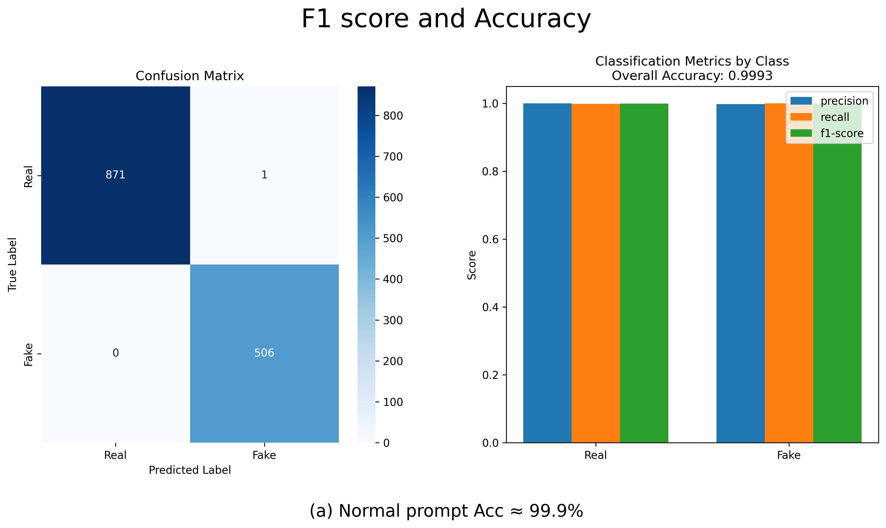
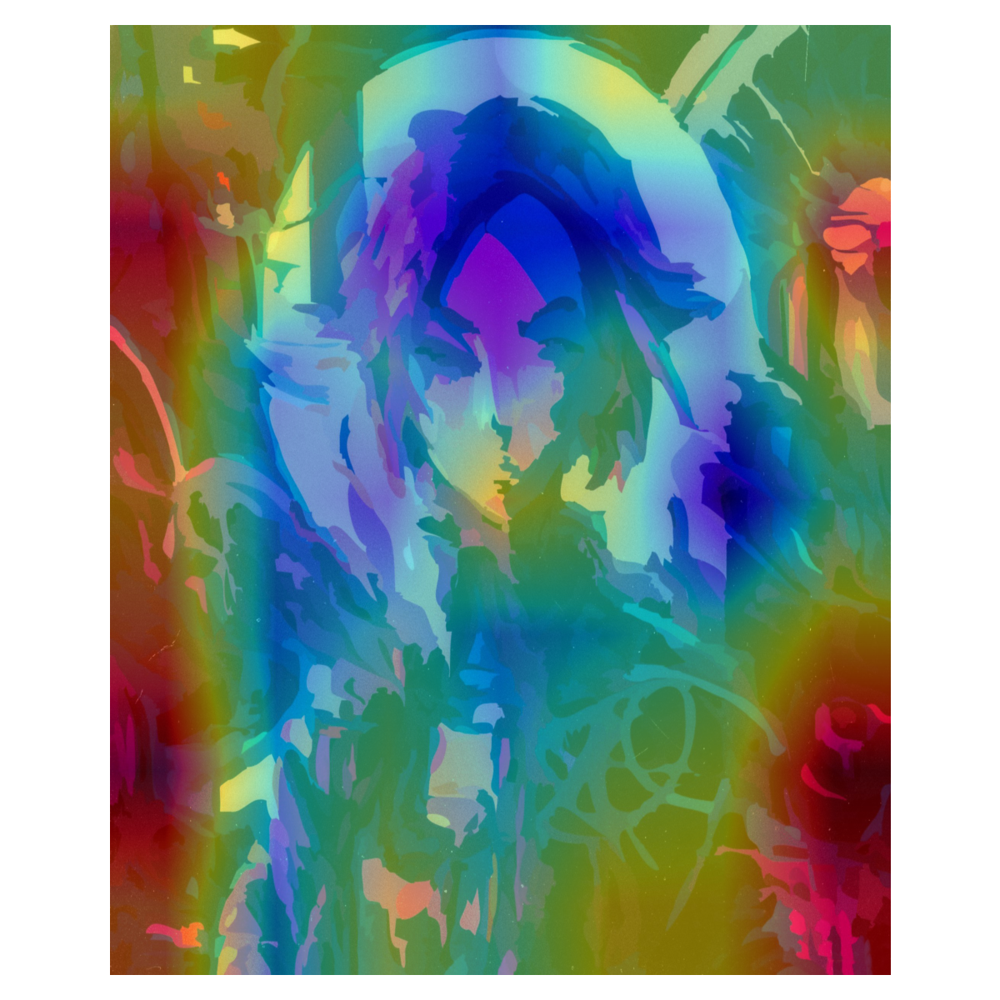
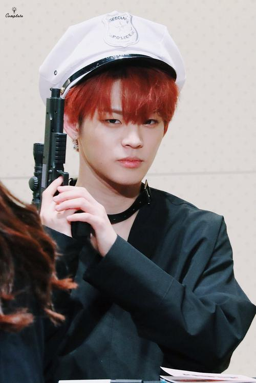
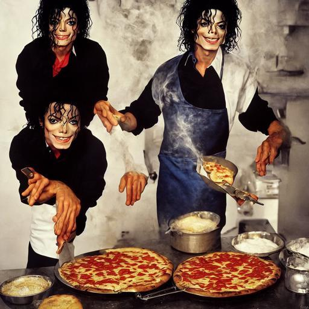
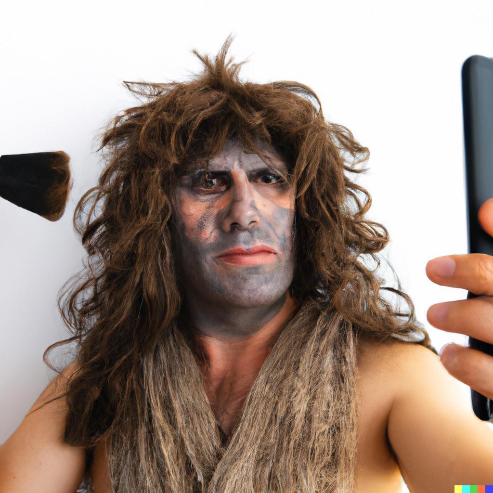

# AI-Generated Twitter Detection  
*A CLIP-Based Approach to Identifying AI-Generated Tweets*  
**Yuqing Fan & Zhiyuan Xiao — CSC 245 (Fall 2025)**

## 1. Motivation

AI-generated text–image content is increasingly common on social media.  
Real and synthetic tweets often appear similar, and manual inspection is slow and inconsistent.  
This project asks:

**Can we detect whether an image–text pair is real by measuring their semantic alignment?**

We develop a scalable multimodal detector using CLIP.


## 2. Method Overview

### 🔹 Dataset Construction  
We create real and synthetic tweet pairs.  
AI-generated captions follow a controlled prompt:

> “Look at the image internally. Do not describe the image. Do not explain the image. Write a tweet-style post inspired by its mood or message, keeping it extremely short: 1-2 sentences, under 30 words ...  You may include one or two natural hashtags ... Avoid descriptions, summaries, or analytical language. Output only the tweet.”

This generates natural AI-style captions.

### 🔹 Model Architecture  
We use **CLIP ViT-L/14-336** to extract:

- image embeddings  
- text embeddings  
- cosine similarity  

Feature vector:
[image_emb ∥ text_emb ∥ cosine_sim]

Classifier:  
A 2-layer MLP (hidden size = 512).

Benefits:
- Embeddings retain rich multimodal signals  
- Goes beyond a single similarity score  
- Captures tweet-specific non-linear patterns  


## 3. Results

### 🎯 Accuracy: **87.37%**  
### 🎯 F1 Score: **0.88**



Model behavior:
- Detects most real/fake tweets accurately  
- Balanced precision, recall, and f1  
- Moderate errors:
  - **False Positive**: real image paired with very short generated text  
  - **False Negative**: artistic images or very long text (>77 tokens)

## 4. Interpretability

We analyze:

- **Modal-level contributions** (image vs text vs similarity)  
- **Token contributions** (mask each token)  
- **Image occlusion heatmaps** (patch sensitivity)

Example:



Insights:
- Highlights sensitive image regions  
- Identifies influential words  
- Explains misclassifications  
- Evaluates robustness to text length and visually complex artwork


## 5. Method Improvement & Benchmark Plan

### ✔ Performance Comparison
- **Ours (CLIP + MLP)**: 87.37% accuracy  
- **Zero-shot CLIP**: 55.01% accuracy  
- Large improvement in both accuracy and F1.

### Future Benchmark (still in progress)
Goal: Evaluate *how real* an AI-generated tweet appears.

Possible benchmark dimensions:
- Semantic consistency  
- Visual artifact detection  
- Text style naturalness  
- Cross-model robustness (Midjourney, SD3, DALL·E, etc.)  
- Reasoning-based mismatch detection

| image | text | label | clip sim | object align | fact consistency | attribute consistency | discription coherence | incongruity | clf prob real |
| :--- | :--- | :---: | :---: | :---: | :---: | :---: | :---: | :---: | :---: |
|  | Calm eyes, quiet hands. Time paused in a portrait’s hold. #Art #Silence | 0 | 0.172 | 0.144 | 1.000 | 0.472 | 0.923 | 0.414 | 0.290 |
|  | ECLA | 1 | 0.166 | 0.166 | 1.000 | 0.300 | 0.000 | 0.417 | 0.992 |
|  | Pizza and performance, all in one kitchen. The stage is always ready. #StageChef | 0 | 0.236 | 0.165 | 0.800 | 0.477 | 0.923 | 0.382 | 0.013 |
|  | Mirror selfie: hair’s a riot, face paint’s a mess. But hey, it’s me. #Unfiltered | 0 | 0.231 | 0.157 | 1.000 | 0.459 | 0.824 | 0.385 | 0.036 |
|  | Stone hush. Time’s quiet pulse in these walls. 🌿 #AncientStillness | 0 | 0.139 | 0.150 | 1.000 | 0.478 | 0.900 | 0.430 | 0.387 |

## 6. File Structure
```bash
├── checkpoints/                        # Saved model weights
│   └── best_clip_match_classifier.pt   # Best-performing MLP classifier
├── data/                               # All datasets and related scripts
│   ├── archive/                        # Real tweet dataset (MMHS150K-based) real image/real text
│   ├── fakeV2/                         # AI-generated fake image/fake text dataset
│   ├── real_fake/                      # Mixed real image/fake text pairs for variation  (We do not deal with fake image/real image since We cannot find an appropriate dataset and it  is hard  to build)
│   ├── qwen3_prompt.py                 # Prompt used to generate synthetic tweets
│   ├── train.csv                       # Training split (image_path, text, label)
│   ├── val.csv                         # Validation split
│   └── test.csv                        # Test split
├── build_csv.py                        # Standard CSV builder for real/fake pairs and fake/fake pair
├── build_csv_adapted.py                # Advanced builder for mixed datasets for all pairs
├── clip_tweet_match.py                 # Training script for CLIP + MLP classifier
├── plot_eval.py                        # Evaluation + confusion matrix + metrics plotting
├── visualize_part_contribution.py      # Model-level, token-level, and occlusion analysis
├── Accuracy_and_F1_score.png           # Evaluation visualization (confusion matrix + metrics)
├── contrib_0cd5khj3wo5a1.png           # Example occlusion heatmap from interpretability module
├── requirements.txt                    # Python dependency list
└── README.md                           # this file

```

## 7. Usage

### Install dependencies

```bash
pip install -r requirements.txt
```
### Train model
```bash
python clip_tweet_match.py
```
### Evaluate
```bash
python plot_eval.py
```
### Run interpretability
```bash
python visualize_part_contribution.py `
  --ckpt "checkpoints/best_clip_match_classifier.pt" `
  --image "data/real_fake/real/0cd5khj3wo5a1.jpg" `
  --text "Chasing the glow in the dark, where colors bleed into dreams. 🌌 #VividSoul" `
  --grid 7 `
  --out "contrib_0cd5khj3wo5a1.png"
```
